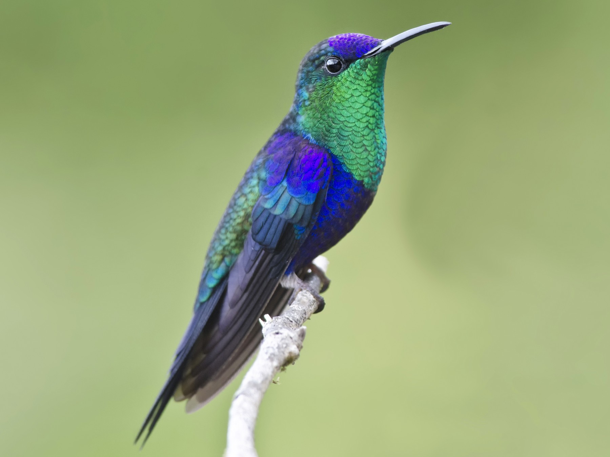
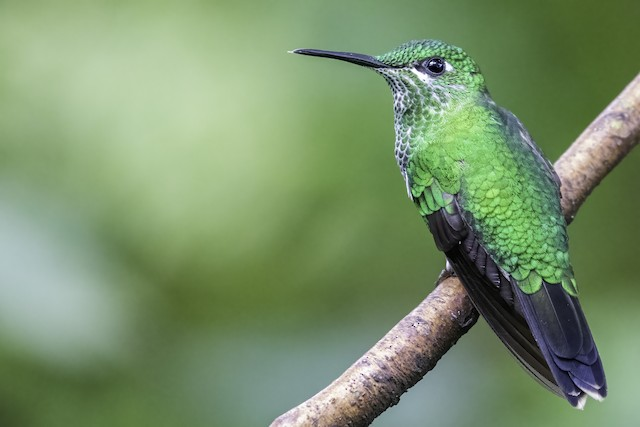
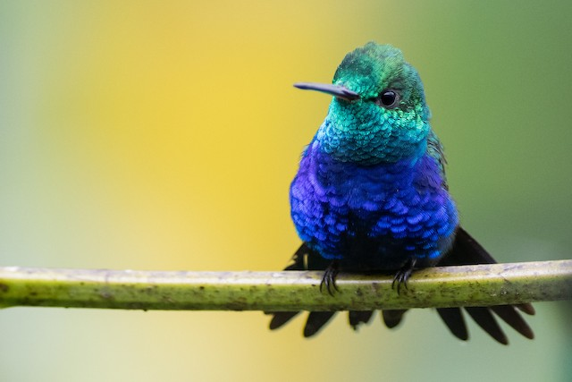
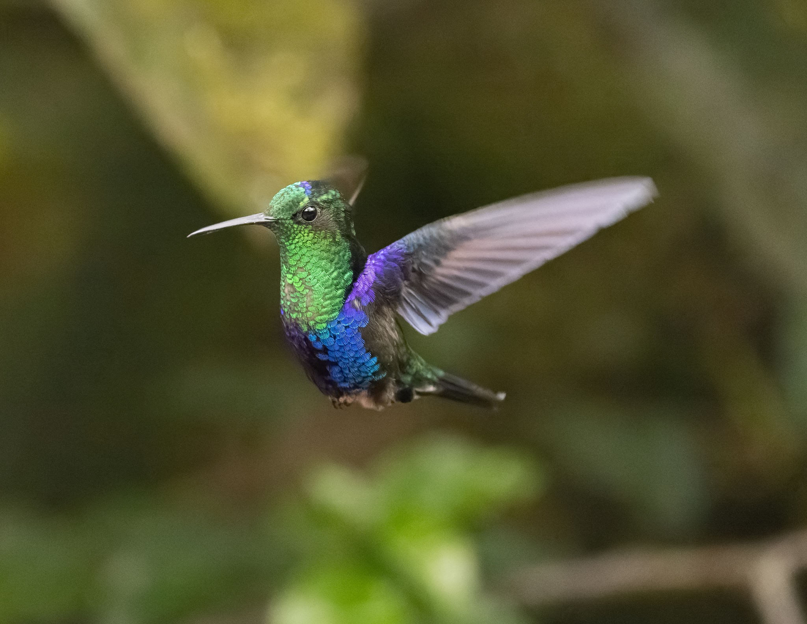

```{r setup, include=FALSE}
knitr::opts_chunk$set(echo = FALSE)

library(tidyverse)
library(gtsummary)
library(gt)
library(flextable)
library(dplyr)
library(knitr)
library(leaflet)
library(hexbin)


```


``` {r data import, warning=FALSE}

avifauna <- read.csv("ecuadorianavifauna.csv")

```

``` {r clean up data, warning=FALSE}

#get rid of NA values in 'sex'
avifauna <- avifauna %>% 
  filter(!is.na(sex))

#get rid of U valies in 'sex'
avifauna <- avifauna %>%
  filter(sex != "U") %>%
  filter(sex != "N") %>%
  filter(sex != "F?") %>%
  filter(sex != "W?")
  
  
```

```{r set builtin theme, warning=FALSE}
theme_gtsummary_mean_sd(set_theme = TRUE)
#Sets default summary statistics to mean and standard deviation in tbl_summary()
#Sets default continuous tests in add_p() to t-test and ANOVA
```

# Raw Data Mean/SD

[The following data is coming from morphological measurements taken on Ecuadorian Avifauna.]{style="color:black"}

```{r basic summary, warning=FALSE}
# summarize the data; summary includes all species, so not that helpful yet
table1 <- 
  avifauna %>%
  tbl_summary(by=sex,
              missing = "no", #gets rid of pesky NAs
              include = c(BILL.LENGTH, BILL.WIDTH, BILL.DEPTH, WING, ELEVATION)) %>%
  modify_footnote(everything() ~ NA)

table1
```


# Example 1

[Study Subject.]{style="color:black"}


## T-test Table

```{r t-test example make the table, warning=FALSE}
#gtsummary works best with datasets without NA values, otherwise it attempts to report # of NAs (annoying)

table_woodnymph <- avifauna %>%
  filter(SPECIES =="CROWNED WOODNYMPH") %>%
  select(sex, BILL.LENGTH, BILL.WIDTH, BILL.DEPTH, WING, ELEVATION) %>% 
  #retain specific variables used in summaries rather than using all
  tbl_summary(
    by = sex,
    missing = "no",
    # remove missing values (NAs). "ifany" will include a missing values row in table.
    digits = all_continuous() ~ 1,
    #number of displayed digits for continuous variables
    label = list(
      BILL.LENGTH ~ "Bill length (mm)",
      BILL.WIDTH ~ "Bill width (mm)",
      BILL.DEPTH ~ "Bill depth (mm)",
      WING ~ "Wing length (mm)",
      ELEVATION ~ "Elevation (m)"
    ),
    statistic = list(all_continuous() ~ "{mean} ({sd})", #can use any character for parentheses
                     all_categorical() ~ "{n}") #count obs. for categorical variables
  ) %>% 
  add_p(pvalue_fun = ~ style_pvalue(.x, digits = 2)) %>% #number of digits displayed for p-values
  modify_caption("Table 1. *Thalurania columbica* Morphological Characteristics") %>%
  modify_footnote(everything() ~ NA) %>%
  modify_header(
    update = list(
      label ~ '',
      stat_1 ~ '**Female**', #is markdown **bold** formatting
      stat_2 ~ '**Male**',
      p.value ~ '**P-value**')
  )

#show_header_names(table_Draco) 
#lets you preview code for changing header names and formatting  
                
table_woodnymph
```


```{r data import and filter, warning=FALSE}
avifauna_woodnymph <- avifauna %>%
  filter(SPECIES == "CROWNED WOODNYMPH") #get one species to work with
```

### T-Test bar chart


```{r t-test plot, warning=FALSE}

avifauna2 <- avifauna_woodnymph %>%
  filter(WING != "NA")

avifauna3 <- avifauna2 %>%
  group_by(sex) %>%
  summarise(meanWingLength = mean(WING),
            seWING = sd(WING)/sqrt(n()))

avifauna2Ttest <- ggplot(avifauna3, aes(x = sex, y = meanWingLength, fill = sex)) +
  geom_bar(stat = 'identity', position = 'dodge') +
  geom_errorbar(aes(ymin = meanWingLength - seWING, ymax = meanWingLength + seWING),
                size = .07, colour = 'black',
                width = .2) +
  labs(y = "Mean Wing Length (mm)") +
  labs(x = "Sex") +
  labs(title = "Crowned Woodnymph")

avifauna2Ttest


```

# Example 2

[Study Subjects.]{style="color:black"}






## Anova Table

```{r example 1 make the table, warning=FALSE}
#this function works best with datasets without NA values

table_hummingbird <- avifauna %>%
  select(SPECIES, sex, BILL.LENGTH, BILL.WIDTH, WING, WEIGHT) %>% #retain variables used in summaries
  filter(SPECIES %in% c("CROWNED WOODNYMPH", "GREEN-CROWNED BRILLIANT", "VIOLET-BELLIED HUMMINGBIRD")) %>%
  tbl_summary(
    by = SPECIES,
    #every species gets its own column and summary stats
    missing = "no",
    # remove missing values (NAs). "ifany" will include a missing values row in table.
    digits = all_continuous() ~ 1,
    #number of displayed digits for continuous variables
    label = list(
      sex ~ "Sex",
      BILL.LENGTH ~ "Bill length (mm)",
      BILL.WIDTH ~ "Bill width (mm)",
      WING ~ "Wing length (mm)",
      WEIGHT ~ "Body mass (g)"
    ),
    statistic = list(all_continuous() ~ "{mean} ({sd})", #can use any character for parentheses
                     all_categorical() ~ "{n}")
  ) %>% #count obs. for categorical variables
  #add_p(snout_vent_length_mm ~ "aov") %>% CANT FIGURE OUT HOW TO FORCE ANOVA
  add_p(pvalue_fun = ~ style_pvalue(.x, digits = 2)) %>% #number of digits displayed for p-values
  modify_caption("Table 2. Hummingbird Characteristics") %>%
  #modify_header(update = all_stat_cols() ~ "**{level}**") %>%  #headers to only contain species name
  #modify_footnote(all_stat_cols() ~ NA) %>% #squashes superscripts for the groups
  modify_header(
    update = list(
      label ~ '',
      stat_1 ~ '**T. columbica**',
      stat_2 ~ '**H. jacula**',
      stat_3 ~ '**C. julie**',
      p.value ~ '**P-value**'
    )
  )

#show_header_names(table_Draco1) 
#lets you preview code for changing header names and formatting  
                
table_hummingbird
```


### Anova Box Plot

```{r Anova plot, warning=FALSE}

avifauna_4 <- avifauna %>%
  filter(SPECIES == c("CROWNED WOODNYMPH","GREEN-CROWNED BRILLIANT", "VIOLET-BELLIED HUMMINGBIRD")) %>%
  filter(WING != "NA")

avifauna_anovaplot <- ggplot(avifauna_4, aes(x = sex, y = WING, colour = SPECIES)) +
  geom_boxplot(fill = 'beige') +
  xlab("Sex") +
  ylab("Wing length (mm)") +
  labs(colour = "Species")

avifauna_anovaplot


```

# Example 3



## Ancova Table

```{r ANCOVA table, warning=FALSE}
#ANCOVA measurements adjusted for SVL covariate

ancova_woodnymph <- avifauna_woodnymph%>% 
  select(BILL.LENGTH, BILL.WIDTH, WING, TAIL, sex)%>%
  tbl_summary(by=sex, 
              #statistic=list(all_continuous()~"{mean}({sd})"), 
              missing="no",
              digits = all_continuous() ~ 1,
              include=c(BILL.LENGTH, WING, TAIL),
              label = list(
                BILL.LENGTH ~ "Bill length (mm)",
                WING ~ "Wing length (mm)",
                TAIL ~ "Tail length (mm)"))%>%
  add_difference(adj.vars=c(BILL.WIDTH))
  #this one line turns it from an ANOVA to an ANCOVA table (magic)
  #add_p(pvalue_fun = ~ style_pvalue(.x, digits = 2))   #cannot get to work; throws error

ancova_woodnymph
```

```{r see if gtsummary results match a generic GLM result}
model_1 <- lm(WING ~ BILL.WIDTH + sex, data=avifauna2)
#notice this is a parallel slopes model (How can you tell?)
```


### Ancova plots

```{r ANCOVA plot, warning=FALSE}
#make ANCOVA from a fit model; one of many ways to do this.
model_1_fortified <- fortify(model_1)
ggplot(model_1) +
  geom_point(aes(x = BILL.WIDTH, y = WING, color = sex)) +
  geom_line(aes(x = BILL.WIDTH, y = .fitted, color = sex)) +
  geom_vline(xintercept=mean(avifauna_woodnymph$BILL.WIDTH), linetype='dashed', color='blue', size=0.5) +
  xlab("Bill Width (mm)") +
  ylab("Wing Length (mm)") #this was my theme defined in a script
```


[Ancova plot with conditional means.]{style="color:black"}


```{r Ancova plot2, message=TRUE, warning=FALSE}

ggplot(avifauna2, aes(x = BILL.WIDTH, y = WING, colour = sex)) +
  geom_point() +
  geom_smooth(method = 'lm') +
  xlab("Bill Width (mm)") +
  ylab("Wing Length (mm") +
  theme_bw()

```